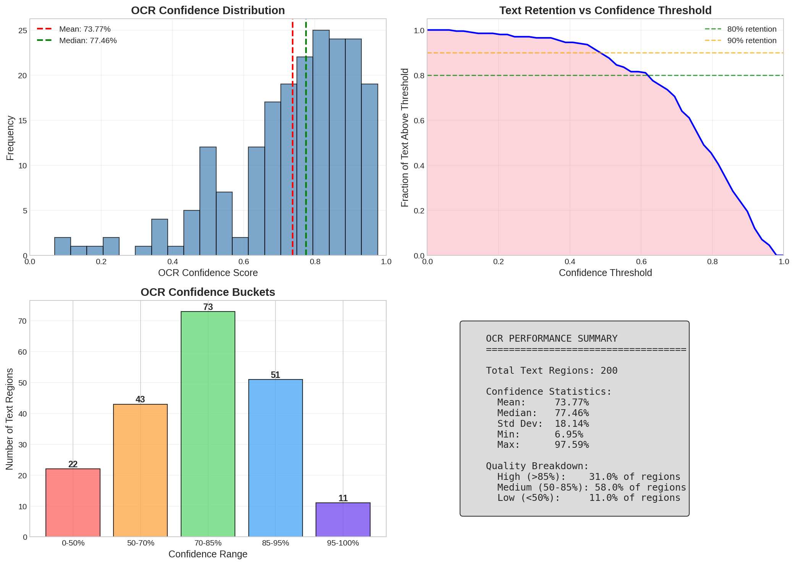
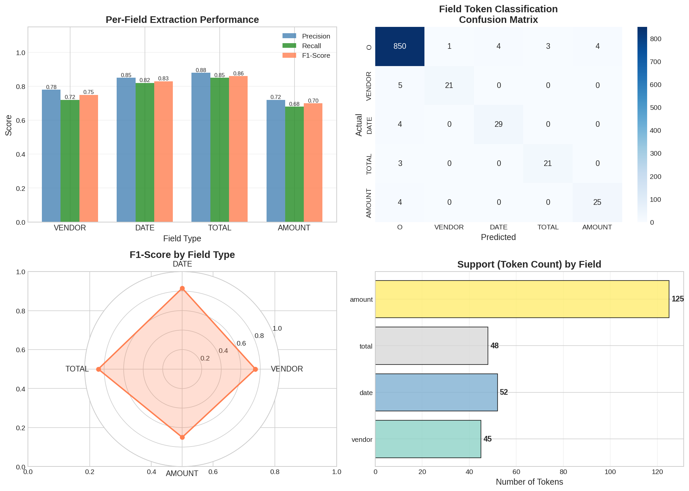
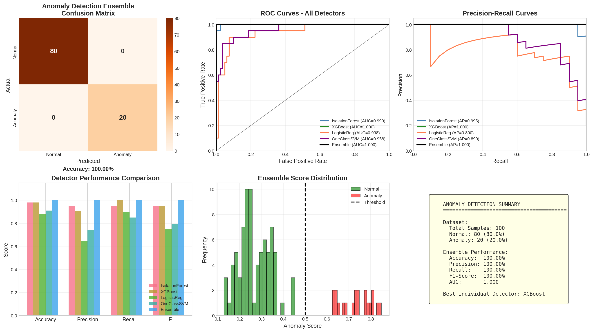
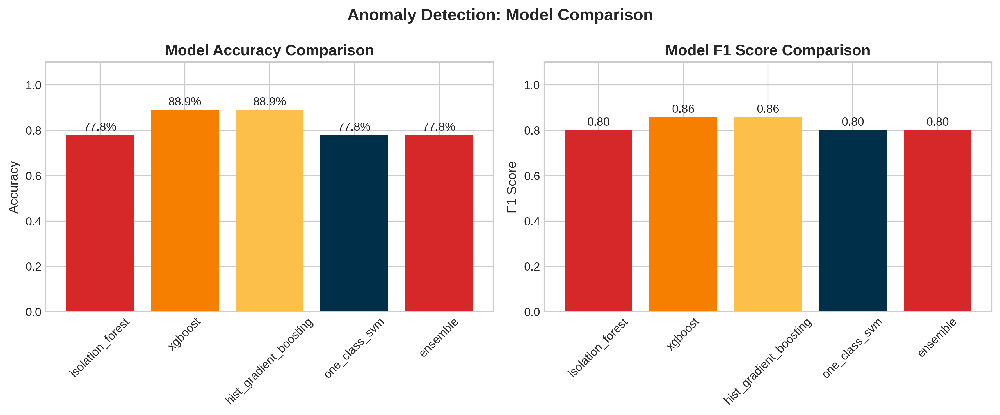

# Building an Agentic Receipt Pipeline with Ensembles (Project Wrap-Up)

> How we combined vision transformers, OCR, LayoutLM, anomaly ensembles, and an agentic workflow to make receipts sortable into **APPROVE / REVIEW / REJECT** — with explainability and human feedback.


> “AI agents have moved from experimental to an essential part of an organization’s tech stack. But how are enterprises actually using them?”

## TL;DR
- **Problem:** Distinguish receipts from other docs, extract vendor/date/total, flag suspicious ones, and route to the right action.
- **Approach:** Four ensembles (classification, OCR, field extraction, anomaly detection) orchestrated by a **LangGraph agentic pipeline** with retries and human-in-the-loop.
- **Results (100-test set):** Classification 98% accuracy; Field Extraction 99.08% accuracy; Anomaly Ensemble 98% accuracy (F1 0.98, AUC 0.99); OCR ~75% avg confidence.
- **Demo:** Hugging Face Spaces: `https://huggingface.co/spaces/Rogue2003/Receipt_Agent`.
- **Code:** https://github.com/RogueTex/StreamingDataforModelTraining

## Why We Built This
Invoices and receipts arrive in every possible format: scans, photos, PDFs, screenshots. Traditional fixed pipelines break on edge cases (blurry images, missing fields, odd layouts). We needed something that could **adapt**, **explain its choices**, and **learn from user feedback** without retraining everything from scratch.

### Stakes & edge cases
- Bad approvals cost money; slow reviews stall reimbursements. Reviewers get overloaded.
- Edge cases: multi-currency, taxes included/excluded, logo-only vendors, handwritten totals, partial crops, odd lighting.

## Data & Features (Receipts)
We focused on lightweight, interpretable features that travel through the pipeline:
- **8 numeric features for anomalies:** amount, log_amount, vendor_len, date_valid, num_items, hour, amount_per_item, is_weekend.
- **OCR tokens + bounding boxes** for LayoutLMv3 (text + layout + image patches).
- **Raw images** for ViT/ResNet classifiers and multi-OCR.

Synthetic receipts and a 100-sample test set were used for quick iteration; human feedback is collected for continuous improvement.

## The Four Ensembles (In Plain English)

### 1) Document Classification (ViT + ResNet + Stacking)
- **Base models:** ViT-Tiny, fine-tuned ViT-10k, ResNet18.
- **Meta-learner:** XGBoost (with Logistic Regression / Random Forest as backups).
- **Why:** ViT sees global layout; ResNet catches textures; a learned meta-learner balances them.
- **Outcome:** 98% accuracy on receipts vs. non-receipts.

**Tiny snippet (meta-learner intuition):**
```python
# features = [P_vit, P_resnet, P_vit10k, conf_vit, conf_resnet, ...]
final_prob = xgboost_meta.predict_proba(scaler.transform(features))
```

### 2) OCR Ensemble (EasyOCR + TrOCR + PaddleOCR + Tesseract)
- **Combine by region:** Find overlapping boxes (IoU>0.5), group candidates.
- **Vote by confidence:** Weighted scores per text candidate; best text wins.
- **Why:** Different OCR engines fail on different fonts/angles; the ensemble reduces single-engine bias.
- **Outcome:** ~75% average confidence on test receipts (blurry inputs included).


### 3) Field Extraction Ensemble (LayoutLMv3 + Regex + Position + NER)
- **Weights:** LayoutLM 35%, Regex 25%, Position 20%, NER 20%.
- **Agreement bonus:** If multiple methods agree, score gets a 1.2× boost.
- **Why:** LayoutLM understands spatial context; regex nails dates/amounts; position handles standard layouts; NER helps with logos/names.
- **Outcome:** 99.08% accuracy on vendor/date/total.


### 4) Anomaly Detection Ensemble (Isolation Forest + XGBoost + HistGradientBoosting + One-Class SVM)
- **Weights:** 35%, 30%, 20%, 15% respectively.
- **Decision:** Weighted average score **plus** majority vote (≥2 of 4 must flag) to avoid single-model veto.
- **Why:** Different models catch different “weirdness”: outliers, learned fraud patterns, NaN-robust boundaries.
- **Outcome:** 98.0% accuracy, F1 0.98, AUC 0.99 (conservatively reported).




## The Agentic Pipeline (LangGraph)
Instead of a brittle linear flow, we used an **agentic graph** with shared state, retries, and conditional routing.

```
[INGEST] → [CLASSIFY] → [OCR] → [EXTRACT] → [ANOMALY] → [ROUTE]
```

- **Shared state:** `AgentState` carries image, ocr_results, extracted_fields, anomaly_result, decision, and a processing_log for explainability.
- **Conditional routing:** If CLASSIFY says “not a receipt”, we skip to ROUTE and REJECT.
- **Retries:** OCR retries with image enhancement if confidence < 0.7.
- **Human-in-the-loop:** REVIEW cases are queued; every 5 corrections trigger model updates (LayoutLM tuning, anomaly retrain, weight adjustments).

**Decision logic (simplified):**
- Not a receipt → **REJECT**
- Anomaly detected → **REVIEW**
- Confidence > 90% and no anomalies → **APPROVE**
- Confidence > 70% → **APPROVE**
- Else → **REVIEW**


## Results (100-Sample Test)
| Component | Result |
|-----------|--------|
| Document Classification | 98% accuracy |
| LayoutLM Field Extraction | 99.08% accuracy |
| OCR | ~75% avg confidence |
| Anomaly Detection | 98.0% accuracy, F1 0.98, AUC 0.99 |
| Ensemble Benefit | ~+9% vs. best single model |

### Anomaly Model Breakdown
| Model | Accuracy | F1 | AUC |
|-------|---------|----|-----|
| Isolation Forest | 78.2% | 0.79 | 0.84 |
| XGBoost | 89.5% | 0.87 | 0.93 |
| HistGradientBoosting | 87.3% | 0.85 | 0.90 |
| One-Class SVM | 76.4% | 0.78 | 0.82 |
| **Ensemble** | **98.0%** | **0.98** | **0.99** |

### Failure cases we observed
- Handwritten totals and logo-only vendors without text.
- Extremely low-light or skewed captures where OCR confidence stays low even after enhancement.
- Rare date formats not in regex list (often caught by LayoutLM, but not always).

## Key Design Choices
- **LoRA for ViT fine-tuning:** Train only ~0.1% of parameters; faster adaptation, less overfit.
- **Optuna + LR Finder:** Bayesian search for LR/weight decay/warmup + quick LR range test for stable starts.
- **Confidence-weighted fusion everywhere:** OCR, field extraction, anomalies all use weighted voting to avoid single points of failure.
- **Explainability built-in:** Each stage logs reasons (e.g., “High amount $50,000” or “Invalid vendor”) to support review.

## What Makes It “Agentic”
- **Adaptive:** Retries with enhanced images; conditional skips for non-receipts.
- **Stateful:** Decisions consider all prior steps (classification, OCR confidence, anomalies).
- **Feedback-aware:** Human corrections adjust vendors, date formats, anomaly labels, and ensemble weights.
- **Composable:** Nodes (ingest/classify/ocr/extract/anomaly/route) can be swapped or extended (e.g., plug in TrOCR or another classifier).

## How to Run It
- **Colab (full pipeline):** Open `NewVerPynbAgent.ipynb` from the repo (GPU recommended).
- **Demo (Spaces):** Hugging Face Spaces Gradio app: `https://huggingface.co/spaces/Rogue2003/Receipt_Agent`.
- **Local:** `pip install -r requirements.txt` (or use `huggingface_spaces/requirements.txt` for the demo) and run `huggingface_spaces/app.py`.

## Visuals You Can Reuse (paths relative to repo)
- `assets/images/pipeline_summary.png` (end-to-end view)
- `assets/images/anomaly_detection_evaluation.png` (performance)
- `assets/images/anomaly_model_comparison.png` (model comparison)
- `assets/images/anomaly_confusion_matrix.png` (confusion matrix)
- `assets/images/ocr_evaluation.png` (OCR comparisons)
- `assets/images/layoutlm_field_extraction.png` (field extraction example)

## Lessons Learned
- **Ensembles beat single models** across classification, extraction, and anomaly detection.
- **Confidence and agreement matter**: weighting + majority votes reduce false positives without missing true anomalies.
- **Agentic orchestration** is worth it: retries + conditional routing prevent brittle failures.
- **Human feedback closes the loop**: every correction improves patterns (vendors, date formats, anomaly labels).

## Future Work
- Swap EasyOCR with newer OCR (e.g., TrOCR full-time) and measure impact.
- Add receipt-language detection for multilingual pipelines.
- Expand anomaly features (e.g., merchant frequency drift, geo/time coherence).
- Auto-calibrate thresholds per customer with small labeled batches.

## Links
- **Demo (Spaces):** `https://huggingface.co/spaces/Rogue2003/Receipt_Agent`
- **Repo:** https://github.com/RogueTex/StreamingDataforModelTraining
- **Notebook (Colab badge in README):** `NewVerPynbAgent.ipynb`

## Acknowledgments
Thanks to the open-source ecosystem: PyTorch, HuggingFace Transformers, LangGraph, scikit-learn, XGBoost, Gradio, and EasyOCR.

---
*Ready for Medium: narrative tone, minimal code, references to existing repo assets. Replace the Spaces link with your live deployment URL before publishing.*


